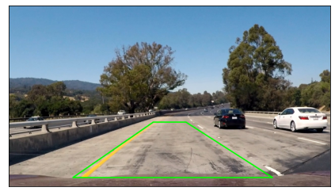
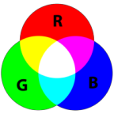
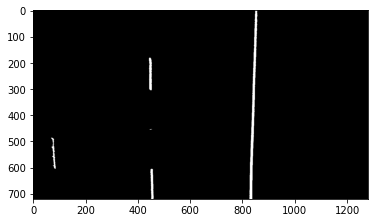
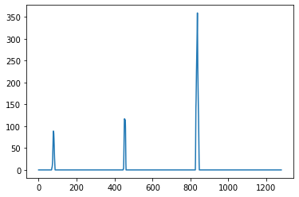
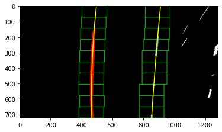
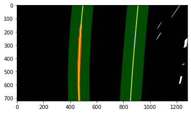
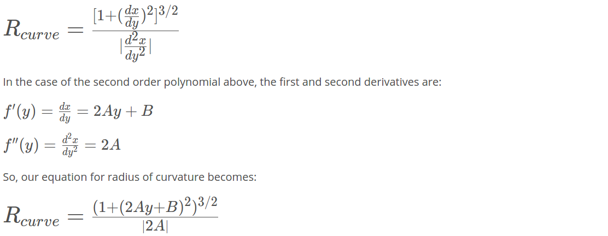

Advanced Lane Finding
---
[](http://www.udacity.com/drive)

[](https://www.youtube.com/watch?v=sY47Zs5aN0c)

The goals / steps of this project are the following:

* Compute the camera calibration matrix and distortion coefficients given a set of chessboard images.
* Apply a distortion correction to raw images.
* Use color transforms, gradients, etc., to create a thresholded binary image.
* Apply a perspective transform to rectify binary image ("birds-eye view").
* Detect lane pixels and fit to find the lane boundary.
* Determine the curvature of the lane and vehicle position with respect to center.
* Warp the detected lane boundaries back onto the original image.
* Output visual display of the lane boundaries and numerical estimation of lane curvature and vehicle position.

Image processing pipeline
---
Following flow chart will be described how this image processing pipeline development thing happening advanced computer vision techniques.  


Camera calibration
---

Camera resectioning determines which incoming light is associated with each pixel on the resulting image [[Wikipedia](https://en.wikipedia.org/wiki/Camera_resectioning)]. 

##### Find and draw chessboard

Before calibration images, chessboard was detected from provided chessboard iamges by using OpenCV `cv2.findChessboardCorners` function. Following are the detected chessboard results. Red reactangle highlighted were not detected as chessbords. 


Here is the function that was used to find chessboard from images.

```python
# prepare objects points
objp = np.zeros((6*9, 3), np.float32)
objp[:,:2] = np.mgrid[0:9, 0:6].T.reshape(-1,2)

# Arrays to store object points and iamg points from all the images
objpoints = []
imgpoints = []

def find_and_draw_chessboard(img, pattern_size= (9,6)):
    gray = grayscale(img)

    # find the chessboard corners
    ret, corners = cv2.findChessboardCorners(gray, pattern_size, None)

    # if found, add object points, image points
    if ret:
        objpoints.append(objp)
        imgpoints.append(corners)

        # draw and display the corners
        cv2.drawChessboardCorners(img, pattern_size, corners, ret)
    
    # if not found, return same input image
    return img
```       

**Following OpenCV function was used to calibrate above chessboards found images**

```python
# Do Camera calibration given objects' points and images' points
# mtx - camera calibrated matrix
# dist - distortion cofficients
ret, mtx, dist, rvecs, tvecs = cv2.calibrateCamera(objpoints, imgpoints,img_size, None, None)

```
Above `mtx` and `dist` will be used to undistort images in the pipeline.

##### Distortion correction
**Image distortion** occurs when a camera looks at 3D objects in the real world and transforms them into a 2D image; this transformation isn’t perfect. Distortion actually changes what the shape and size of these 3D objects appear to be. So, the first step in analyzing camera images, is to undo this distortion so that you can get correct and useful information out of them.

`cv2.undistort` can be used to corret distortion of images. Following are the sample images to show undistortion


Perspective transformation
---
A perspective transform maps the points in a given image to different, desired, image points with a new perspective. The perspective transform you’ll be most interested in is a bird’s-eye view transform that let’s us view a lane from above; this will be useful for calculating the lane curvature later on. Aside from creating a bird’s eye view representation of an image, a perspective transform can also be used for all kinds of different view points.

Perspective transfomation can be done using following steps.
##### Step 01: 
Select four source coordation points from given image and these points were used for all other as well with a generic adgusment.  
Selected **source** points:  
`p1 = (575, 465)` `p2 = (705, 465)` `p3 = (255, 685)` `p4 = (1050, 685)`   
Selected **destination** coordinates.  
`pd1 =(450, 0)` `pd2 = (width - 450, 0)` `pd3 = (450, height)` `pd4 = (width - 450, height)`  
Here height and width are recpectively number of rows and number of colomn in an raw image. Following is an image with drawan polygon by using **source** points.



##### Step 02:
Apply OpenCV `cv2.getPerspectiveTransform` function to select a region as **bird-eye** view. Following function was used to warpe raw images.

```python
# define source and destination points for tranform
src = np.float32([p1, p2, p3, p4])
dst = np.float32([pd1, pd2, pd3, pd4])

def unwarp(img, source=src, desctination=dst):
    """
    This is used to select a region from a given undistortion image as bird eye perspective.
    
    :param img - Distortion corrected image
    :param src - source 
    :param dst - destination
    :return - warped image, transform matrix, and inverse
    """
    h,w = img.shape[:2]
    # use cv2.getPerspectiveTransform() to get M, the transform matrix, and Minv, the inverse
    M = cv2.getPerspectiveTransform(src, dst)
    Minv = cv2.getPerspectiveTransform(dst, src)
    # use cv2.warpPerspective() to warp your image to a top-down view
    warped = cv2.warpPerspective(img, M, (w,h), flags=cv2.INTER_LINEAR)
    return warped, M, Minv
    
```    
Here is the sample result of above function.


Working with colour spaces and channels
---
On road lane line images, we have to detect two major colors such that yellow and white. By seeing bellow color venn diagram we can get some idea about how other colors are making with three major colors. I have tested with four color spaces sush that RGB, HSV, HLS, and LAB. 



Following functions were used to extract color channels from color spaces.

```python
# These utilitis are used to extract different color channels from different color spaces.

# Extract R,G, and B color channels from RGB color space.
def extract_rgb_color_spaces(uwimg):
    unwarp_R = uwimg[:, :, 0]
    unwarp_G = uwimg[:, :, 1]
    unwarp_B = uwimg[:, :, 2]
    return unwarp_R,unwarp_G,unwarp_B

# Extract H,S, and V color channels from HSV color space.
def extract_hsv_color_spaces(uwimg):
    unwarp_HSV = cv2.cvtColor(uwimg, cv2.COLOR_RGB2HSV)
    unwarp_H = unwarp_HSV[:, :, 0]
    unwarp_S = unwarp_HSV[:, :, 1]
    unwarp_V = unwarp_HSV[:, :, 2]
    return unwarp_H,unwarp_S,unwarp_V

# Extract H,S, and L color channels from HLS color space.
def extract_hls_color_spaces(uwimg):
    unwarp_HLS = cv2.cvtColor(uwimg, cv2.COLOR_RGB2HLS)
    unwarp_HLS_H = unwarp_HLS[:, :, 0]
    unwarp_HLS_L = unwarp_HLS[:, :, 1]
    unwarp_HLS_S = unwarp_HLS[:, :, 2]
    
    return unwarp_HLS_H,unwarp_HLS_L,unwarp_HLS_S
    
# Extract L,A, and B color channels from LAB color space.
def extract_lab_color_spaces(uwimg):
    unwarped_LAB = cv2.cvtColor(uwimg, cv2.COLOR_RGB2Lab)
    unwarp_L = unwarped_LAB[:,:,0]
    unwarp_A = unwarped_LAB[:,:,1]
    unwarp_B = unwarped_LAB[:,:,2]
    return unwarp_L, unwarp_A,unwarp_B
    
```    
I have applied above functions to detect lane lines edges from road images. Following are the results that I got with each color filters. I have tested two different images to detect lane lines.

##### RGB color space results


##### HSV color space results


##### HLS color space results


##### LAB color space results


##### Color spaces conclutions
**LAB** color space **B** was perfomed well to detect yellow lane lines from the roads images. For white lane lines, we have few options to select color channels. **HLS** **L** was perfomed well to detect white lane lines from road images.

With the above conclutions, I select to only two color channels to apply gredient threshold filters. 

### Gradient threshold
When we are detecting edges from road images, there are ohter edges will be detected with Canny edge detection. We have to minimize those unnecessary edge detections. One of the improved version of Canny edge detection is **Sobel operator**[[Wikipedia](https://en.wikipedia.org/wiki/Sobel_operator)].  Applying the Sobel operator to an image is a way of taking the derivative of the image in the x or y direction.

#### Sobel absolute threshold
Following function was used to apply sobel absolute filter

```python
def abs_sobel_thresh(gray, orient='x', thresh_min=0, thresh_max=255):
    """
    This is used to create abinary image using a grayscaled image. 
    
    :param gray - Grayscaled or binary image
    :param orient - x or y derections of the image
    :param thresh_min - minimum value for binary threshold
    :param thresh_max - maximum value for binary threshold
    :return - A binary image after appying Sobel absolute threshold
    """
    # Apply the following steps to img
    # 1) Take the derivative in x or y given orient = 'x' or 'y'
    dx = 1 if orient=='x'  else  0
    dy = 1 if orient=='y'  else  0

    sobel = cv2.Sobel(gray, cv2.CV_64F,dx ,dy)
    # 2) Take the absolute value of the derivative or gradient
    abs_sobel = np.absolute(sobel)
    # 3) Scale to 8-bit (0 - 255) then convert to type = np.uint8
    scaled_sobel = np.uint8(255*abs_sobel/np.max(abs_sobel))
    # 4) Create a mask of 1's where the scaled gradient magnitude
            # is > thresh_min and < thresh_max
        
    binary_sobel = np.zeros_like(scaled_sobel)
    binary_sobel[(scaled_sobel >= thresh_min) & (scaled_sobel <= thresh_max)] = 1
    
    return binary_sobel

```
Following are the some of results after applying above filter.


#### Sobel direction of the gradient
The magnitude, or absolute value, of the gradient is just the square root of the squares of the individual x and y gradients. For a gradient in both the **x** and **y** directions, the magnitude is the square root of the sum of the squares. Following function was used to calculate direction of the gradient.

```python
def dir_threshold(gray, sobel_kernel=3, thresh=(0, np.pi/2)):
    """
    This is used to generate sobel direction of the warped gray images
    """
    # Calculate the x and y gradients
    sobelx = cv2.Sobel(gray, cv2.CV_64F, 1, 0, ksize=sobel_kernel)
    sobely = cv2.Sobel(gray, cv2.CV_64F, 0, 1, ksize=sobel_kernel)
    # Take the absolute value of the gradient direction, 
    # apply a threshold, and create a binary image result
    absgraddir = np.arctan2(np.absolute(sobely), np.absolute(sobelx))
    
    binary_output =  np.ones_like(absgraddir)
    
    binary_output[(absgraddir >= thresh[0]) & (absgraddir <= thresh[1])] = 0

    # Return the binary image
    return binary_output
```
And following were a few results afater applying sobel gradient direction filter.


After applying above sobel gradient and sobel absolute filter, we can notice how both filters results are varing for two colors such that yellow and white. Now we can combine both filters and can see how combine filter is working for both yellow and white lane lines. Following function was used to combine filters.

```python
def combine_thresholds(unwarp_img, gray, mag_kernel, mag_thresh, dir_thresh, dir_kernel ):
    """
    This is used to combine sobel magnitude and sobel direction gradients.
    """
    gradx = abs_sobel_thresh(gray, orient='x', thresh_min=mag_thresh[0], thresh_max=mag_thresh[1])
    grady = abs_sobel_thresh(gray, orient='y', thresh_min=mag_thresh[0], thresh_max=mag_thresh[1])
    
    mag_binary = mag_threshold(gray, sobel_kernel=mag_kernel, mag_thresh=mag_thresh)
    
    dir_binary = dir_threshold(gray, sobel_kernel=dir_kernel, thresh=dir_thresh)
    
    combined = np.zeros_like(dir_binary)
    combined[((gradx == 1) & (grady == 1)) | ((mag_binary == 1) & (dir_binary == 1))] = 1
    
    # A combine binary image 
    return combined
```
Following are the few results for combine filter.


#### Normalize color channels
HLS L channel and LAB B was perfomed well to detect yellow and white lane lines, now we can nomalize both color channels to smooth edges. Following functions were used to nomalize color channels.

######  Nomalize HLS L color channel

```python
def hls_l_nomalize(img, thresh=(220, 255)):
    """
    This is used to nomalize HLS L color channel
    """
    # 1) Convert to HLS color space
    _,hls_l,_ = extract_hls_color_spaces(img)
    hls_l = hls_l*(255/np.max(hls_l))
    # 2) Apply a threshold to the L channel
    binary_output = np.zeros_like(hls_l)
    binary_output[(hls_l > thresh[0]) & (hls_l <= thresh[1])] = 1
    # 3) Return a binary image of threshold result
    return binary_output

```

######  Nomalize LAB B color channel

```python
def lab_b_nomalize(unwarped_img, thresh=(190,255)):
    """
    This is used to LAB B color channel
    """
    _,_,lab_b = extract_lab_color_spaces(unwarped_img)
    # don't normalize if there are no yellows in the image
    if np.max(lab_b) > 175:
        lab_b = lab_b*(255/np.max(lab_b))
    # 2) Apply a threshold to the L channel
    binary_output = np.zeros_like(lab_b)
    binary_output[((lab_b > thresh[0]) & (lab_b <= thresh[1]))] = 1
    # 3) Return a binary image of threshold result
    return binary_output
```

Following are the results of above filters respectively.


#### Image pipeline
```python
def pipeline(p_img):
    
    # Undistort images
    undistort_img = undistort(p_img)
    
    # Persfective transform
    img_unwarp,M, Minv = unwarp(undistort_img, src, dst)
    
    # HLS L-channel Threshold (using default parameters)
    img_hls_L = hls_l_nomalize(img_unwarp)

    # Lab B-channel Threshold (using default parameters)
    img_lab_B = lab_b_nomalize(img_unwarp)
    
    # Combine HLS and Lab B channel thresholds
    combined = np.zeros_like(img_lab_B)
    combined[(img_hls_L == 1) | (img_lab_B == 1)] = 1
    
    return combined, Minv
    
```
Following are the a few samples of pipeline output.


Above pipeline can be used to contine next steps image processing.


Detect lane boundaries
---
To detect lane boundaries we can peaks in a histogram. As we notice around the lane boundaries average white pixel density is higer than comparativelty other regions. Using following function we can generate a histogram data points from a binary image.

```python
def hist(img):
    """
    This is used to extract data points for a histogram
    """
    # Grab only the bottom half of the image
    bottom_half = img[img.shape[0]//2:,:]
    # Sum across image pixels vertically - make sure to set an `axis`
    # i.e. the highest areas of vertical lines should be larger values
    histogram = np.sum(bottom_half, axis=0)
    
    return histogram
```
Following are the image and it's relevant lane line boundaries histogram  

 


Pipeline's extracted binary image, pixels are either 0 or 1, so the two most prominent peaks in this histogram will be good indicators of the x-position of the base of the lane lines. We can use that as a starting point for where to search for the lines. From that point, we can use a sliding window, placed around the line centers, to find and follow the lines up to the top of the frame.

#### Implement sliding windows and fit a polynomial
We can use the two highest peaks from our histogram as a starting point for determining where the lane lines are, and then use sliding windows moving upward in the image (further along the road) to determine where the lane lines go.

###### Split the histogram for the two lines
The first step we'll take is to split the histogram into two sides, one for each lane line. Following are the used functions' utilities to split histogram for the two lane lines.

```python
# Take a histogram of the bottom half of the image
histogram = np.sum(img[img.shape[0]//2:,:], axis=0)
# Find the peak of the left and right halves of the histogram
# These will be the starting point for the left and right lines
midpoint = np.int(histogram.shape[0]//2)
quarter_point = np.int(midpoint//2)
# Previously the left/right base was the max of the left/right half of the histogram
# this changes it so that only a quarter of the histogram (directly to the left/right) is considered
leftx_base = np.argmax(histogram[quarter_point:midpoint]) + quarter_point
rightx_base = np.argmax(histogram[midpoint:(midpoint+quarter_point)]) + midpoint
```

###### Set up windows and window hyperparameters
The next step is to set a few hyperparameters related to our sliding windows, and set them up to iterate across the binary activations in the image.

```python
# Choose the number of sliding windows
nwindows = 10
# Set height of windows
window_height = np.int(img.shape[0]/nwindows)
# Identify the x and y positions of all nonzero pixels in the image
nonzero = img.nonzero()
nonzeroy = np.array(nonzero[0])
nonzerox = np.array(nonzero[1])
# Current positions to be updated for each window
leftx_current = leftx_base
rightx_current = rightx_base
# Set the width of the windows +/- margin
margin = 80
# Set minimum number of pixels found to recenter window
minpix = 40
# Create empty lists to receive left and right lane pixel indices
left_lane_inds = []
right_lane_inds = []
# Rectangle data for visualization
rectangle_data = []

```

###### Iterate through selected windows to track curvature

```python
# Step through the windows one by one
for window in range(nwindows):
    # Identify window boundaries in x and y (and right and left)
    win_y_low = img.shape[0] - (window+1)*window_height
    win_y_high = img.shape[0] - window*window_height
    win_xleft_low = leftx_current - margin
    win_xleft_high = leftx_current + margin
    win_xright_low = rightx_current - margin
    win_xright_high = rightx_current + margin
    rectangle_data.append((win_y_low, win_y_high, win_xleft_low, win_xleft_high, win_xright_low, win_xright_high))
    # Identify the nonzero pixels in x and y within the window
    good_left_inds = ((nonzeroy >= win_y_low) & (nonzeroy < win_y_high) & (nonzerox >= win_xleft_low) & (nonzerox < win_xleft_high)).nonzero()[0]
    good_right_inds = ((nonzeroy >= win_y_low) & (nonzeroy < win_y_high) & (nonzerox >= win_xright_low) & (nonzerox < win_xright_high)).nonzero()[0]
    # Append these indices to the lists
    left_lane_inds.append(good_left_inds)
    right_lane_inds.append(good_right_inds)
    # If you found > minpix pixels, recenter next window on their mean position
    if len(good_left_inds) > minpix:
        leftx_current = np.int(np.mean(nonzerox[good_left_inds]))
    if len(good_right_inds) > minpix:        
        rightx_current = np.int(np.mean(nonzerox[good_right_inds]))
```

###### Fit a polynomial

```python
# Concatenate the arrays of indices
left_lane_inds = np.concatenate(left_lane_inds)
right_lane_inds = np.concatenate(right_lane_inds)

# Extract left and right line pixel positions
leftx = nonzerox[left_lane_inds]
lefty = nonzeroy[left_lane_inds] 
rightx = nonzerox[right_lane_inds]
righty = nonzeroy[right_lane_inds] 

left_fit, right_fit = (None, None)
# Fit a second order polynomial to each
if len(leftx) != 0:
    left_fit = np.polyfit(lefty, leftx, 2)
if len(rightx) != 0:
    right_fit = np.polyfit(righty, rightx, 2)
```

Note: Complete function can be found [`Advanced_Lane_Finding.ipynb`](Advanced_Lane_Finding.ipynb)file.  
Following are showing original image and expected output after applying above functions.

 

Now we can use above frames to fit left and right lane lines with second order polynomial fuctions. Following fuction was used to fit second order polynomials.

```python
def polyfit_using_prev_fit(binary_warped, left_fit_prev, right_fit_prev):
    nonzero = binary_warped.nonzero()
    nonzeroy = np.array(nonzero[0])
    nonzerox = np.array(nonzero[1])
    margin = 80
    left_lane_inds = ((nonzerox > (left_fit_prev[0]*(nonzeroy**2) + left_fit_prev[1]*nonzeroy + left_fit_prev[2] - margin)) & 
                      (nonzerox < (left_fit_prev[0]*(nonzeroy**2) + left_fit_prev[1]*nonzeroy + left_fit_prev[2] + margin))) 
    right_lane_inds = ((nonzerox > (right_fit_prev[0]*(nonzeroy**2) + right_fit_prev[1]*nonzeroy + right_fit_prev[2] - margin)) & 
                       (nonzerox < (right_fit_prev[0]*(nonzeroy**2) + right_fit_prev[1]*nonzeroy + right_fit_prev[2] + margin)))  

    # Again, extract left and right line pixel positions
    leftx = nonzerox[left_lane_inds]
    lefty = nonzeroy[left_lane_inds] 
    rightx = nonzerox[right_lane_inds]
    righty = nonzeroy[right_lane_inds]
    
    left_fit_new, right_fit_new = (None, None)
    if len(leftx) != 0:
        # Fit a second order polynomial to each
        left_fit_new = np.polyfit(lefty, leftx, 2)
    if len(rightx) != 0:
        right_fit_new = np.polyfit(righty, rightx, 2)
        
    return left_fit_new, right_fit_new, left_lane_inds, right_lane_inds
```

The `polyfit_using_prev_fit` function performs basically the same task, but alleviates much difficulty of the search process by leveraging a previous fit and only searching for lane pixels within a certain range of that fit. And following are above function resuls.

 

Determine curvature of the lane line
---
In this step we'll find curvature of left and right lanes. By using `polyfit_using_prev_fit` function we can locate lane line pixels, used their **x** and **y** pixel position to fit a secondorder polynomial curve.


We are fitting for `f(y)` rather than `f(x)`, because the lane lines in the warped image(bird-eye view) are near vertical and may have the same x value for more than one y value.


Source: https://video.udacity-data.com/topher/2016/December/58449a23_color-fit-lines/color-fit-lines.jpg


#### Radius of curvature
The radius of curvature at any point x of the function x=f(y) is given as follows: 


