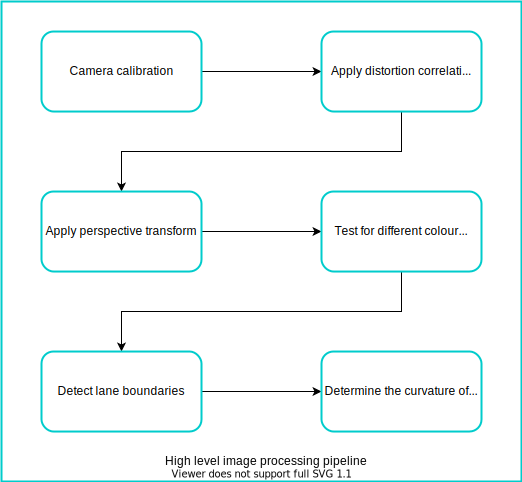
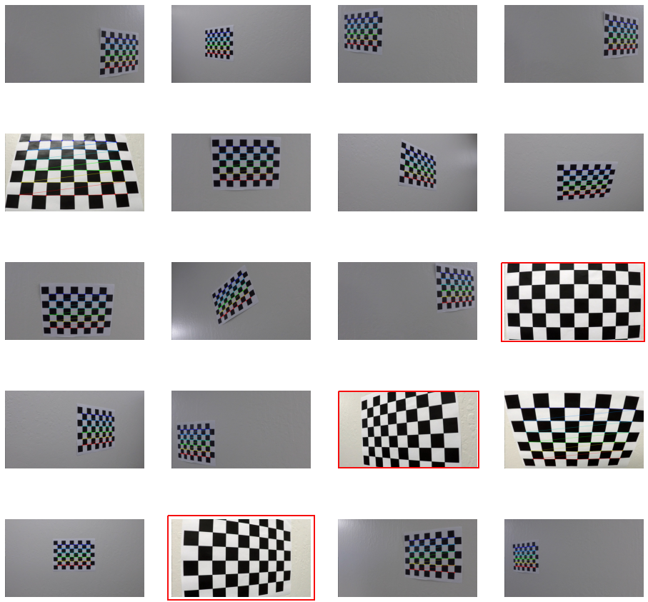

## Advanced Lane Finding
[](http://www.udacity.com/drive)

The Project
---

The goals / steps of this project are the following:

* Compute the camera calibration matrix and distortion coefficients given a set of chessboard images.
* Apply a distortion correction to raw images.
* Use color transforms, gradients, etc., to create a thresholded binary image.
* Apply a perspective transform to rectify binary image ("birds-eye view").
* Detect lane pixels and fit to find the lane boundary.
* Determine the curvature of the lane and vehicle position with respect to center.
* Warp the detected lane boundaries back onto the original image.
* Output visual display of the lane boundaries and numerical estimation of lane curvature and vehicle position.

Image processing pipeline
---
Following flow chart will be described how this image processing pipeline development thing happening advanced computer vision techniques.  



Camera calibration
---

Camera resectioning determines which incoming light is associated with each pixel on the resulting image [[Wikipedia](https://en.wikipedia.org/wiki/Camera_resectioning)]. 

##### Find and draw chessboard

Before calibration images, chessboard was detected from provided chessboard iamges by using OpenCV `cv2.findChessboardCorners` function. Following are the detected chessboard results. Red reactangle highlighted were not detected as chessbords. 



Here is the function that was used to find chessboard from images.

```python
# prepare objects points
objp = np.zeros((6*9, 3), np.float32)
objp[:,:2] = np.mgrid[0:9, 0:6].T.reshape(-1,2)

# Arrays to store object points and iamg points from all the images
objpoints = []
imgpoints = []

def find_and_draw_chessboard(img, pattern_size= (9,6)):
    gray = grayscale(img)

    # find the chessboard corners
    ret, corners = cv2.findChessboardCorners(gray, pattern_size, None)

    # if found, add object points, image points
    if ret:
        objpoints.append(objp)
        imgpoints.append(corners)

        # draw and display the corners
        cv2.drawChessboardCorners(img, pattern_size, corners, ret)
    
    # if not found, return same input image
    return img
```       

**Following OpenCV function was used to calibrate above chessboards found images**

```python
# Do Camera calibration given objects' points and images' points
# mtx - camera calibrated matrix
# dist - distortion cofficients
ret, mtx, dist, rvecs, tvecs = cv2.calibrateCamera(objpoints, imgpoints,img_size, None, None)

```
Above `mtx` and `dist` will be used to undistort images in the pipeline.

##### Distortion correction
**Image distortion** occurs when a camera looks at 3D objects in the real world and transforms them into a 2D image; this transformation isn’t perfect. Distortion actually changes what the shape and size of these 3D objects appear to be. So, the first step in analyzing camera images, is to undo this distortion so that you can get correct and useful information out of them.

`cv2.undistort` can be used to corret distortion of images. Following are the sample images to show undistortion


Perspective transformation
---
A perspective transform maps the points in a given image to different, desired, image points with a new perspective. The perspective transform you’ll be most interested in is a bird’s-eye view transform that let’s us view a lane from above; this will be useful for calculating the lane curvature later on. Aside from creating a bird’s eye view representation of an image, a perspective transform can also be used for all kinds of different view points.

Perspective transfomation can be done using following steps.
##### Step 01: 
Select four source coordation points from given image and these points were used for all other as well with a generic adgusment.  
Selected **source** points:  
`p1 = (575, 465)` `p2 = (705, 465)` `p3 = (255, 685)` `p4 = (1050, 685)`   
Selected **destination** coordinates.  
`pd1 =(450, 0)` `pd2 = (width - 450, 0)` `pd3 = (450, height)` `pd4 = (width - 450, height)`  
Here height and width are recpectively number of rows and number of colomn in an raw image. Following is an image with drawan polygon by using **source** points.


##### Step 02:
Apply OpenCV `cv2.getPerspectiveTransform` function to select a region as **bird-eye** view. Following function was used to warpe raw images.

```python
# define source and destination points for tranform
src = np.float32([p1, p2, p3, p4])
dst = np.float32([pd1, pd2, pd3, pd4])

def unwarp(img, source=src, desctination=dst):
    """
    This is used to select a region from a given undistortion image as bird eye perspective.
    
    :param img - Distortion corrected image
    :param src - source 
    :param dst - destination
    :return - warped image, transform matrix, and inverse
    """
    h,w = img.shape[:2]
    # use cv2.getPerspectiveTransform() to get M, the transform matrix, and Minv, the inverse
    M = cv2.getPerspectiveTransform(src, dst)
    Minv = cv2.getPerspectiveTransform(dst, src)
    # use cv2.warpPerspective() to warp your image to a top-down view
    warped = cv2.warpPerspective(img, M, (w,h), flags=cv2.INTER_LINEAR)
    return warped, M, Minv
    
```    
Here is the sample result of above function.


Working with colour spaces and channels
---
On road lane line images, we have to detect two major colors such that yellow and white. By seeing bellow color venn diagram we can get some idea about how other colors are making with three major colors. I have tested with four color spaces sush that RGB, HSV, HSL, and LAB. 


Following functions were used to extract color channels from color spaces.

```python
# These utilitis are used to extract different color channels from different color spaces.

# Extract R,G, and B color channels from RGB color space.
def extract_rgb_color_spaces(uwimg):
    unwarp_R = uwimg[:, :, 0]
    unwarp_G = uwimg[:, :, 1]
    unwarp_B = uwimg[:, :, 2]
    return unwarp_R,unwarp_G,unwarp_B

# Extract H,S, and V color channels from HSV color space.
def extract_hsv_color_spaces(uwimg):
    unwarp_HSV = cv2.cvtColor(uwimg, cv2.COLOR_RGB2HSV)
    unwarp_H = unwarp_HSV[:, :, 0]
    unwarp_S = unwarp_HSV[:, :, 1]
    unwarp_V = unwarp_HSV[:, :, 2]
    return unwarp_H,unwarp_S,unwarp_V

# Extract H,S, and L color channels from HSL color space.
def extract_hsl_color_spaces(uwimg):
    unwarp_HSL = cv2.cvtColor(uwimg, cv2.COLOR_RGB2HLS)
    unwarp_HSL_H = unwarp_HSL[:, :, 0]
    unwarp_HSL_S = unwarp_HSL[:, :, 1]
    unwarp_HSL_L = unwarp_HSL[:, :, 2]
    return unwarp_HSL_H,unwarp_HSL_S,unwarp_HSL_L
    
# Extract L,A, and B color channels from LAB color space.
def extract_lab_color_spaces(uwimg):
    unwarped_LAB = cv2.cvtColor(uwimg, cv2.COLOR_RGB2Lab)
    unwarp_L = unwarped_LAB[:,:,0]
    unwarp_A = unwarped_LAB[:,:,1]
    unwarp_B = unwarped_LAB[:,:,2]
    return unwarp_L, unwarp_A,unwarp_B
    
```    
I have applied above functions to detect lane lines edges from road images. Following are the results that I got with each color filters. I have tested two different images to detect lane lines.

##### RGB color space results


##### HSV color space results


##### HSL color space results


##### LAB color space results


##### Color spaces conclutions
**LAB** color space **B** was perfomed well to detect yellow lane lines from the roads images. For white lane lines, we have few options to select color channels. **HSL** **S** was perfomed well to detect white lane lines from road images.

